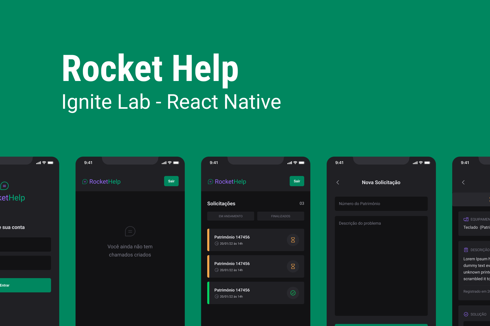

# Rocket help (Aplicativo construído no Ignite Lab)

## Capa
    

## Funcionalidades da aplicação
- Login e Logout com o firebase
- Listagem de solicitações
- Filtro para as solicitações abertas e fechadas
- Cadastro de novas solicitações

## Stack
- React Native
- Typescript
- Native Base
- React Navigation
- Firebase

## Principais aprendizados
- Utilização do Native Base para estilização de forma declarativa.
- Utilização do Firebase para fazer a parte de autenticação e banco de dados da aplicação.

## Design da aplicação
- Clique [aqui](https://www.figma.com/file/427Ts6r1nBx7PogonEWhaB/Rocket-Help---Ignite-Lab-(Community)?node-id=37%3A6) para acessar o layout da aplicação

